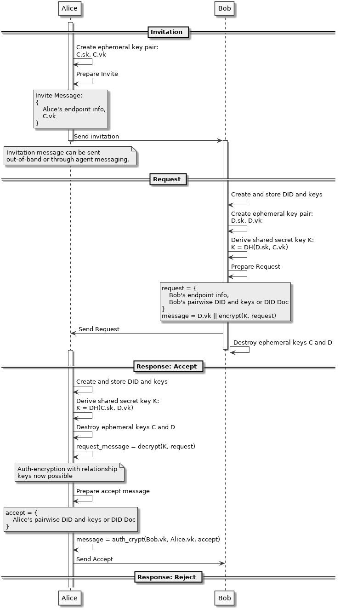

- Name: connection-protocol
- Author: Daniel Bluhm <daniel.bluhm@sovrin.org>
- Start Date: 2018-18-09
- PR:
- Jira Issue:

# Summary
[summary]: #summary

A definition of a connection establishment protocol. This HIPE differs greatly from the previously proposed connection
protocol HIPE in a number of ways. Those differences include providing forward secrecy, shifting much of the
implementation details to indy-sdk, and being significantly simpler.

# Motivation
[motivation]: #motivation

Create a protocol that agent developers can use to establish connections between different agent implementations while
providing requisite privacy and security.

# Tutorial
[tutorial]: #tutorial

This HIPE will establish the exchange of messages or information needed to establish a pairwise connection between two
agents.

## Assumptions

The details of transporting a message from one agent to the other will also not be covered in this HIPE. We assume the
message packaging and transport details are correctly executed when using phrases like "Agent 1 sends the message
to Agent 2."

## Overview

The connection protocol can be simply illustrated in the following sequence diagram:



## Definitions

### Message Family

We propose that the message family used for the messages in this protocol will be `connection`, with a version of `1.0`,
resulting in the message type string:

```
did:sov:BzCbsNYhMrjHiqZDTUASHg;spec/connection/1.0/<message_type>
```

in accordance with the [proposed HIPE on message types](https://github.com/hyperledger/indy-hipe/pull/19).


### Message Types

#### Connection Invitation

A connection invitation is used to transmit the essential data necessary to initiate a connection request message. These
invitations are **out-of-band communication** and are not a true agent message or agent message type. The means used to
transmit connection invitations may be implemented in any number of proprietary ways. However, all connection
invitations must transmit at least the following information:

- Endpoint DID
- Connection key (one time use)

or

- Endpoint URI
- Endpoint key
- Connection key (one time use)

If an endpoint DID is used, it is assumed that the endpoint URI and endpoint key can be looked up in the DID Document
that the DID references. Otherwise, the endpoint URI and endpoint key are explicitly provided.

#### Connection Key

A connection key is a single-use key that helps to verify the authenticity of connection requests received

#### Connection Request

A connection request is used to minimally transmit the information needed by the receiver to communicate with the sender
in a pairwise relationship.

##### Type

We propose that the message type for a connection request will be `request`, resulting in the following message type
string:

```
did:sov:BzCbsNYhMrjHiqZDTUASHg;spec/connection/1.0/request
```

##### Example and Attributes

A connection request minimally includes the following information:

```json
{
    "@type": "did:sov:BzCbsNYhMrjHiqZDTUASHg;spec/connection/1.0/request",
    "@thread": { ... },
    "did": "did:sov:123456...",
    --- or ---
    "diddoc": { ... }
}
```

###### Attributes

- `@thread` - the threading "decorator" described in [this HIPE](https://github.com/hyperledger/indy-hipe/pull/30).
  This decorator is used to identify which connection the message is referring to.
- `did` or `diddoc` - the `did` attribute can be used to look up all information needed in the pairwise relationship
  (endpoints and keys) or a `diddoc` can be provided, resulting in the same set of information.

##### Usage in negotiation

In the future, we anticipate that connection request messages will play a role in "crypto negotiation," or the process
of negotiating cryptography standards to be used for keys and encryption methods. Details of this process will be given
at a later date.

------------------------------------------------------------------------------------------------------------------------

#### Connection Offer

The connection offer message is anticipated to be used in "crypto negotiation."

Further detail on crypto negotiation and connection offers will be supplied in the future.

##### Type

We propose that the message type for a connection offer will be `offer`, resulting in the following message type string:

```
did:sov:BzCbsNYhMrjHiqZDTUASHg;spec/connection/1.0/offer
```

------------------------------------------------------------------------------------------------------------------------

#### Connection Accept

Connection acceptance messages are used to transmit both acceptance of the sender's request and the information needed
by the request sender to communicate with the receiver in a pairwise relationship.

##### Type

We propose that the message type for the connection acceptance message will be `accept`, resulting in the following
message type string:

```
did:sov:BzCbsNYhMrjHiqZDTUASHg;spec/connection/1.0/accept
```

##### Example and Attributes

```json
{
    "@type": "did:sov:BzCbsNYhMrjHiqZDTUASHg;spec/connection/1.0/accept",
    "@thread": { ... },
    "did": "did:sov:123456...",
    --- or ---
    "diddoc": { ... }
}
```

##### Attributes
- `@thread` - The threading object used to correlate different messages with each other.
- `did` or `diddoc` - the `did` attribute can be used to look up all information needed in the pairwise relationship
  (endpoints and keys) or a `diddoc` can be provided, resulting in the same set of information.

------------------------------------------------------------------------------------------------------------------------

#### Connection Reject

Connection rejection messages are used to convey the receiver's rejection of the sender's request to connection.

After receiving this message, the request sender dismisses all allocated DIDs and Keys

##### Type

We propose that the message type for the connection rejection message will be `reject`, resulting in the following
message type string:

```
did:sov:BzCbsNYhMrjHiqZDTUASHg;spec/connection/1.0/reject
```

##### Example and Attributes

The connection rejection message contains only the threading object and the message type. No further information is
needed.

An example connection rejection message would then look like the following:

```json
{
    "@type": "did:sov:BzCbsNYhMrjHiqZDTUASHg;spec/connection/1.0/reject",
    "@thread": { ... }
}
```

##### Unresolved Questions

- Do we want to optionally supply some type of "reason" attribute?

------------------------------------------------------------------------------------------------------------------------

## Example interactions

Using the message family defined above, we will now consider an example of Alice and Bob establishing a connection and
examine the flow of messages between the two parties.

1. Alice and Bob meet at a conference and decide that they want to connect.
2. Alice creates a connection request and invitation (the exact form of the invitation will be established in another HIPE).
  - Alice sends the invitation to Bob (in a manner to be specified by another HIPE).
  - Bob receives the invitation and uses it to obtain an agent, if he doesn't already own one, and receive the
    connection request that Alice created.

Bob now has several choices:

#### 3a. Bob rejects the connection.

Bob sends a rejection message to Alice using the information Alice provided for the relationship, terminating the
relationship. When Alice's agent receives the rejection, the DID and key generated for the relationship are dismissed.

#### 3b. Bob decides to negotiate the terms of the connection.

Bob sends a connection offer message to Alice with altered terms. Alice indicates acceptance by sending a matching
connection request

> **TODO:** fill out the remainder of the HIPE

#### 3c. Bob accepts the request.

# Reference
[reference]: #reference

Provide guidance for implementers, procedures to inform testing,
interface definitions, formal function prototypes, error codes,
diagrams, and other technical details that might be looked up.
Strive to guarantee that:

- Interactions with other features are clear.
- Implementation trajectory is well defined.
- Corner cases are dissected by example.

- [Connection State Machine by Daniel Hardman](https://docs.google.com/spreadsheets/d/1RLJhhlWCUBYpKn18S5BGi7HH9MfGiZdHBxKjsJavoMs/edit#gid=0)
- [Video describing Connection State Machine by Daniel Hardman](http://bit.ly/2nhQMRC)

# Drawbacks
[drawbacks]: #drawbacks

Why should we *not* do this?

# Rationale and alternatives
[alternatives]: #alternatives

- Why is this design the best in the space of possible designs?
- What other designs have been considered and what is the rationale for not
choosing them?
- What is the impact of not doing this?

# Prior art
[prior-art]: #prior-art

Discuss prior art, both the good and the bad, in relation to this proposal.
A few examples of what this can include are:

- Does this feature exist in other SSI ecosystems and what experience have
their community had?
- For other teams: What lessons can we learn from other attempts?
- Papers: Are there any published papers or great posts that discuss this?
If you have some relevant papers to refer to, this can serve as a more detailed
theoretical background.

This section is intended to encourage you as an author to think about the
lessons from other implementers, provide readers of your proposal with a
fuller picture. If there is no prior art, that is fine - your ideas are
interesting to us whether they are brand new or if they are an adaptation
from other communities.

Note that while precedent set by other communities is some motivation, it
does not on its own motivate an enhancement proposal here. Please also take
into consideration that Indy sometimes intentionally diverges from common
identity features.

# Unresolved questions
[unresolved]: #unresolved-questions

- What parts of the design do you expect to resolve through the
enhancement proposal process before this gets merged?
- What parts of the design do you expect to resolve through the
implementation of this feature before stabilization?
- What related issues do you consider out of scope for this
proposal that could be addressed in the future independently of the
solution that comes out of this doc?
